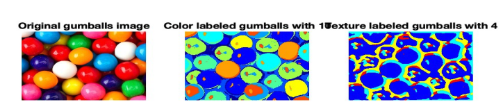
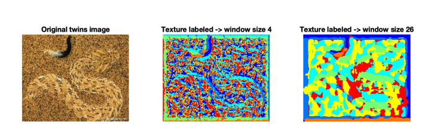

# EdgeSeg: Edge Detection and Image Segmentation

## Overview

This project focuses on edge detection and image segmentation techniques in computer vision. The assignment includes the implementation of gradient-based edge detection, oriented filters, and image segmentation using k-means clustering. The results of these operations are displayed and analyzed using various tools and functions developed in MATLAB.

### Author
- **Name**: Huang Jun Xiang (Anthony Huang)
- **Email**: anthonyhuang1909@gmail.com

## Project Structure

### Edge Detection

The edge detection section consists of gradient-based edge detection and oriented filter-based edge detection:

#### Key Files:
- **`edgeGradient.m`**: Implements gradient-based edge detection.
- **`edgeOrientedFilters.m`**: Implements edge detection using oriented filters.
- **`gradientMagnitude.m`**: Computes gradient magnitudes for edge detection.
- **`orientedFilterMagnitude.m`**: Calculates oriented filter magnitudes for edge detection.

#### Supporting Utilities:
- **`boundaryBench.m`**: Benchmarks edge detection performance.
- **`boundaryPRfast.m`**: Computes precision-recall for edge detection.
- **`evaluateSegmentation.m`**: Evaluates the segmentation results based on boundary metrics.
- **`nonmax.m`**: Applies non-maximum suppression for edge refinement.
- **`seg2bmap.m`**: Converts segmented images into binary maps.

### Image Segmentation

The image segmentation section explores k-means clustering and texton-based segmentation.

#### Key Files:
- **`compareSegmentations.m`**: Compares different segmentation results based on color and texture.
- **`createTextons.m`**: Creates textons using filter responses from the image.
- **`extractTextonHists.m`**: Extracts histograms of textons for image segmentation.
- **`quantizeFeats.m`**: Quantizes features using k-means clustering.
- **`segmentMain.m`**: Main function for performing image segmentation using textons.

#### Results:
- **`coins.jpg`**: Example image used for segmentation and comparison.
- **`gumballs.jpg`**: Another image used to evaluate segmentation performance.
- **`planets.jpg`**: Image used in segmentation evaluation.
- **`snake.jpg`**: Used for testing different segmentation strategies.
- **`twins.jpg`**: Another image for segmentation testing.

### Data and Results

The dataset used includes various images and segmentation results. The results from the edge detection and image segmentation tasks are shown in the following images:

#### Edge Detection Results
- **Figure 1**: Edge Detection Result 1  
  

- **Figure 2**: Edge Detection Result 2  
  

- **Figure 3**: Edge Detection Result 3  
  

- **Figure 4**: Edge Detection Result 4  
  

#### Image Segmentation Results
- **Figure 5**: Segmentation Result 1  
  

- **Figure 6**: Segmentation Result 2  
  

- **Figure 7**: Segmentation Result 3  
  

- **Figure 8**: Segmentation Result 4  
  

## Files Overview

### Edge Detection Related Files
- **`boundaryBenchGraphs.m`**: Generates graphs to benchmark edge detection performance.
- **`boundaryBenchHtml.m`**: Outputs results as HTML.
- **`correspondPixels.m`**: Function to find corresponding pixels in images.
- **`readSeg.m`**: Reads segmentation data.
- **`segFilename.m`**: Gets the filename for a segmentation file.

### Image Segmentation Related Files
- **`extractTextonHists.asv`**: Extracts histograms of textons for segmentation evaluation.
- **`filterBank.mat`**: Contains the filter bank used for segmentation.
- **`makeRFSfilters.m`**: Generates filters for the segmentation process.
- **`segmentMain.asv`**: An alternate version of the main segmentation function.

### Results Directory
- **Result Images**: The `result/` directory contains images generated from edge detection and image segmentation processes.
  - **`1.png`** to **`4.png`**: Results from edge detection and segmentation experiments.

## Conclusion

This project explores important techniques in edge detection and image segmentation, providing insights into how these algorithms can be implemented and evaluated. The results show the effectiveness of different methods, and the comparisons help in understanding how parameters like sigma and window size affect the segmentation and edge detection performance.

### Next Steps
- Further refine the algorithms by incorporating advanced techniques like deep learning.
- Optimize the edge detection and segmentation methods for real-time applications.
- Experiment with additional datasets to test the generalizability of the methods.

## Requirements

To run this project, you will need the following tools and libraries:
- **MATLAB**: For implementing edge detection and segmentation algorithms.
- **Image Processing Toolbox**: For functions like `imgaussfilt`, `edge`, and `gradient`.
- **Statistics and Machine Learning Toolbox**: For k-means clustering.
